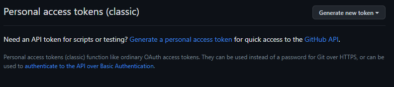
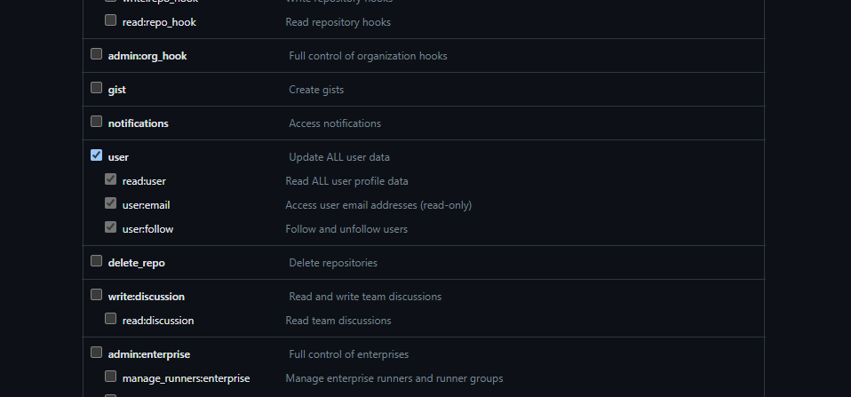

# Automatic bio changer

Automatic bio changer is program that will automatically change your bio on supported platforms.

## Supported platforms

1. Github
2. Discord

## Disclaimer

If you use it with discord **it is against the DISCORD'S TERMS OF SERVICE**.
You can get banned from Discord.
**Use this program at your own risk.**

## Features

1. Web interface
2. Custom bio template
3. Custom configuration

## Installation

You can install this program to you own server.

### 1. Clone this repository

```
git clone https://github.com/jzitnik-dev/automatic-bio-changer
```

### 2. Go to folder

```
cd automatic-bio-changer
```

### 3. Install required libraries

```
pip install -r requirements.txt
```

### 4. Run the server

```
python3 main.py
```

## How to get tokens

### Discord

[Here is the link to the tutorial for discord token.](https://www.androidauthority.com/get-discord-token-3149920/)

### Github

1. Go to [this link](https://github.com/settings/tokens)
2. Click "Generate new token"



3. Click "Generate new token (classic)"
4. Set "Note" to "change-bio" and "expiration" to "No expiration"
5. Scroll down a bit and select "user"



6. Click "Generate token"
7. Copy generated token and paste it into settings
